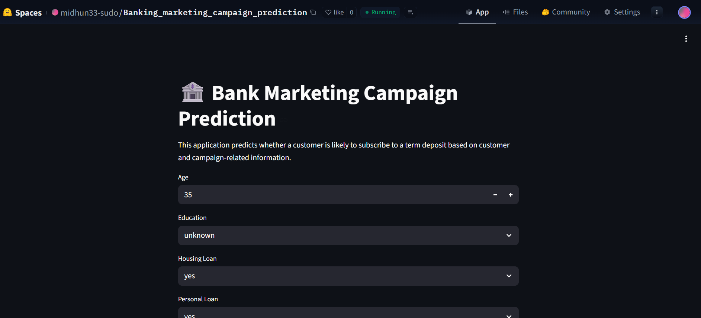

# 🏦 Banking Marketing Campaign Prediction

## 🌐 Live Demo

**Hugging Face Deployment**

https://huggingface.co/spaces/midhun33-sudo/Banking_marketing_campaign_prediction



---


## 📌 Project Overview

This project predicts whether a customer will subscribe to a **term deposit** offered through a bank's telemarketing campaign.

Banks spend significant resources contacting customers through phone campaigns. Predicting potential subscribers before making calls can help improve campaign effectiveness, reduce operational costs, and increase conversion rates.

The project covers the complete Machine Learning lifecycle:

* Data Understanding
* Exploratory Data Analysis (EDA)
* Feature Engineering
* Model Building
* Model Optimization
* Model Evaluation
* Deployment using Streamlit
* Hosting using Hugging Face Spaces

---

## 🎯 Problem Statement

A bank wants to improve the effectiveness of its telemarketing campaigns.

The challenge is:

> Can we predict whether a customer will subscribe to a term deposit based on their personal information and previous campaign interactions?

The target variable is:

| Target | Meaning                    |
| ------ | -------------------------- |
| Yes    | Customer subscribed        |
| No     | Customer did not subscribe |

---

## 📊 Dataset Information

### Dataset Summary

| Metric            | Value                 |
| ----------------- | --------------------- |
| Rows              | ~45,000               |
| Columns           | 17                    |
| Target Variable   | Subscription (Yes/No) |
| Missing Values    | None                  |
| Duplicate Records | None                  |

### Features

#### Customer Information

* Age
* Job
* Marital Status
* Education
* Balance
* Housing Loan
* Personal Loan

#### Campaign Information

* Contact Type
* Last Call Duration
* Number of Campaign Contacts
* Previous Contacts
* Previous Campaign Outcome

---

## 🚀 Sprint 1 - Exploratory Data Analysis (EDA)

### Objectives

* Understand data structure
* Identify patterns and relationships
* Detect outliers and skewness
* Explore target distribution

### Univariate Analysis

#### Numerical Features

Analysis performed using:

* Histograms
* Box Plots
* Distribution Analysis
* Skewness Analysis

Key findings:

* Balance was highly skewed
* Call Duration was highly skewed
* Several features contained significant outliers

#### Categorical Features

Analysis performed using:

* Count Plots
* Frequency Distribution

Key findings:

* Majority of customers did not subscribe
* Housing loan customers were less likely to subscribe
* Previous successful campaign outcomes strongly influenced subscriptions

---

### Bivariate Analysis

Relationships explored between:

* Numerical Features vs Target
* Categorical Features vs Target

Key findings:

* Longer call duration increased subscription likelihood
* Customers with previous successful campaign outcomes had higher conversion rates
* Higher account balance generally correlated with increased subscriptions

---

### Correlation Analysis

Correlation analysis was performed on numerical variables.

Observations:

* Most numerical variables showed weak linear correlation
* No significant multicollinearity detected
* Feature importance methods were later used for selection

---

## ⚙️ Sprint 2 - Feature Engineering & Model Building

### Feature Transformation

The following features exhibited strong positive skewness:

* Balance
* Last Call Duration

Applied:

```python
log1p()
```

Transformation:

* balance → balance_log
* duration → duration_log

---

### Feature Encoding

#### Ordinal Encoding

| Education Level | Encoding |
| --------------- | -------- |
| Unknown         | 0        |
| Primary         | 1        |
| Secondary       | 2        |
| Tertiary        | 3        |

#### Binary Encoding

Applied to:

* Housing Loan
* Personal Loan
* Default Credit

#### One-Hot Encoding

Applied to:

* Job
* Marital Status
* Contact Type
* Previous Outcome

---

### Feature Scaling

StandardScaler was applied to:

* Age
* Campaign Contacts
* Previous Contacts
* Balance Log
* Duration Log

---

## 🤖 Models Evaluated

The following classification models were trained and evaluated:

1. Logistic Regression
2. Gradient Boosting
3. LightGBM
4. Naive Bayes
5. KNN
6. SVM

Evaluation metrics:

* Accuracy
* Precision
* Recall
* F1 Score
* ROC-AUC
* Log Loss

---

## 🚀 Sprint 3 - Model Optimization

### Feature Selection

Feature importance techniques were used to remove low-contributing variables.

Final feature set:

* Age
* Education
* Housing Loan
* Personal Loan
* Contacts in Campaign
* Previous Contacts
* Balance Log
* Duration Log
* Selected One-Hot Encoded Features

---

### Class Imbalance Handling

The dataset exhibited class imbalance.

Applied:

```text
SMOTE (Synthetic Minority Oversampling Technique)
```

to improve minority class learning.

---

### Hyperparameter Tuning

Performed using:

```python
RandomizedSearchCV
```

Optimized:

* Gradient Boosting
* LightGBM

---

### Threshold Optimization

Instead of using the default threshold:

```text
0.50
```

The final threshold was optimized to:

```text
0.60
```

to achieve a better balance between:

* Precision
* Recall
* Business Requirements

---

## 📈 Final Model Comparison

| Model               | Accuracy | Precision | Recall | F1 Score | ROC AUC | Log Loss |
| ------------------- | -------- | --------- | ------ | -------- | ------- | -------- |
| GB Baseline         | 0.9021   | 0.6384    | 0.3771 | 0.4742   | 0.9025  | 0.2310   |
| GB Feature Selected | 0.9032   | 0.6423    | 0.3904 | 0.4856   | 0.9029  | 0.2307   |
| GB + SMOTE          | 0.8534   | 0.4290    | 0.7647 | 0.5496   | 0.8971  | 0.3165   |
| LGB Baseline        | 0.9003   | 0.6193    | 0.3828 | 0.4731   | 0.9034  | 0.2282   |
| LGB Balanced        | 0.8272   | 0.3890    | 0.8365 | 0.5311   | 0.9017  | 0.3707   |
| LGB SMOTE           | 0.8858   | 0.5094    | 0.6371 | 0.5661   | 0.8982  | 0.2559   |

---

## 🏆 Final Selected Model

### Gradient Boosting + SMOTE

Reason for Selection:

* Strong Recall Performance
* Improved Minority Class Detection
* Balanced F1 Score
* Better Campaign Conversion Identification

Final Threshold:

```text
0.60
```

---

## 🚀 Sprint 4 - Deployment

### Application

Developed using:

```text
Streamlit
```

Features:

* Interactive Customer Input Form
* Real-time Predictions
* Probability Estimation
* Subscription Recommendation

---

### Deployment Platform

Hosted on:

```text
Hugging Face Spaces
```

Live Application:

https://huggingface.co/spaces/midhun33-sudo/Banking_marketing_campaign_prediction

---

## 📂 Project Structure

```text
banking_marketing_campaign_prediction/

├── app.py
├── requirements.txt
├── README.md

├── models/
│   ├── bank_marketing_final.pkl
│   └── scaler.pkl

├── src/
│   └── predict.py

├── notebooks/
│   └── Banking_marketing_ML_project.ipynb

├── data/
│   ├── train.csv
│   └── test.csv

└── reports/
```

---

## 🛠️ Technologies Used

* Python
* Pandas
* NumPy
* Scikit-Learn
* LightGBM
* Imbalanced-Learn
* Streamlit
* Joblib
* Hugging Face Spaces
* Git & GitHub

---

## 🎯 Future Improvements

* MLflow Integration
* Experiment Tracking
* Docker Containerization
* Automated Retraining Pipeline
* Advanced Feature Engineering
* Cloud Deployment (AWS/Azure/GCP)

---

## 👨‍💻 Author

**Midhun**

Machine Learning | Data Science | AI Enthusiast

End-to-End Banking Marketing Campaign Prediction System with Deployment.
